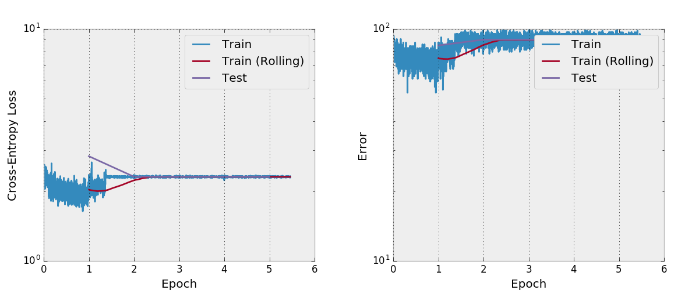

# A PyTorch Implementation of DenseNet

This is a (currently broken)
[PyTorch](http://pytorch.org/) implementation of the
DenseNet-BC architecture as described in the
paper [Densely Connected Convolutional Networks](https://arxiv.org/abs/1608.06993)
by G. Huang, Z. Liu, K. Weinberger, and L. van der Maaten.
Their official implementation and links to many other
third-party implementations are available in the
[liuzhuang13/DenseNet](https://github.com/liuzhuang13/DenseNet)
repo on GitHub.


# Help wanted: CIFAR-10 experiments not converging

I am not sure why my implementation is not converging
on CIFAR-10 and have done extensive gradient and
training procedure checks without finding anything wrong.
I believe this is an issue from something that I have
overlooked or a PyTorch bug, and not an issue with
the DenseNet architecture because there are many other
unofficial DenseNet implementations that work.

To help others conveniently debug the current state
of the code, I have inappropriately put a binary model
file on git so that all of my scripts can be run
without any setup requirements.

## Hidden states and gradients exactly match the official implementation

My implementation seems to exactly the
same as the official implementation.
I have compared
[the official Lua Torch model](https://github.com/liuzhuang13/DenseNet)
to my implementation by painstakingly making the weights
of both models the same and then making sure
the hidden states, output, and gradients matched.
I expected to find an error here, but
was surprised to see that everything matched!

You can look at and run my tests with
[numerically-check-gradients.py](numerically-check-gradients.py).
You should see the following output, which shows
the magnitudes of the gradients w.r.t. the
convolutions in each layer from the beginning to the end.
I think the infs in the LuaTorch weight gradients
are insignificant and some other bug in PyTorch's
legacy code.

```
PyTorch weight gradients:
[0.9444063455315929, 0.2849177441160019, 0.33878492502526214, 0.1985531549290823, 0.25185149994187, 0.15508742770130024, 0.201956105601243, 0.14014060871893197, 0.16417747138456387, 0.11763899513092492, 0.1469825465010488, 0.10418751111079302, 0.13237683566019431, 0.20183229958057938, 0.1004603827732731, 0.11890012417829954, 0.08157595526358567, 0.10317921700476668, 0.06446620099906014, 0.08573154243991049, 0.06234039964671672, 0.07788158954756398, 0.05393001525160663, 0.06934905893966742, 0.04984704183717376, 0.06359818470074498, 0.11944276574456104, 0.048020662895386354, 0.05883042411446804, 0.04660751119333845, 0.05698671594866811, 0.03716609604102968, 0.04878794818722378, 0.02740182194802366, 0.03308057066011531, 0.028586118715640495, 0.03892812739644021, 0.027657867756535656, 0.03428503776165663, 2.210756355336259]
===
LuaTorch weight gradients:
[0.9444063476213133, inf, inf, 0.19855315258914147, inf, 0.15508743292528246, 0.20192410547667589, inf, inf, inf, inf, inf, inf, inf, inf, inf, inf, inf, inf, 0.0857315413413273, 0.06234040198227583, 0.07788158912012436, 0.05380757504397425, 0.06934905639229237, 0.049847044773747254, 0.06359818850592909, 0.11944276507857217, 0.04802066353200282, 0.05883042234772159, 0.04660751235514454, 0.05698671068169084, 0.03716609302136188, 0.048787947172189074, 0.027401821830564565, 0.033080570491649364, 0.028586117033285004, 0.038928123124543454, 0.02765786398808116, 0.03428503638705844, 2.2107562878107583]
```

## Checking the Training Code

Since my model's hidden states and gradients look good, it seems like
there might be an issue with the training code in
[train.py](train.py), which I started with
[the official PyTorch MNIST example](https://github.com/pytorch/examples/blob/master/mnist/main.py).
My training code here will successfully train a resnet model
on CIFAR-10 (not included in this repo)
that gets around 10% test error.
I was also expecting something to go wrong here to help me
find a bug with why my Densenet model isn't converging
and was again surprised to see that my training code
causes a different model to converge.

Other things I've tried changing in the training code:
+ I am also using SGD with momentum and the same learning rate
schedule as described in the DenseNet paper, and
+ I have tried different learning rates as well
as other optimization techniques like ADAM and RMSprop
don't work either.
+ I have tried enabling and disabling data augmentation.

## Other things I've checked
+ I've tried convolutions with and without bias terms.
+ I've numerically checked the gradients of a layer with
a concatenation between the input and output of
the layer since it's traditionally a non-standard operation.

# Running the code and viewing convergence

[./train.py](train.py) will create a model, start training it,
and save progress to `args.save`, which is
`work/cifar10.base` by default.
The training script will call [plot.py](plot.py) after
every epoch to create plots from the saved data.

Here's a typical convergence plot that the current
code in the master branch should produce.
In many cases like this, the network quickly gets stuck
in a bad place.
Other times, the convergence is obviously too slow.



# What the convergence should look like

From
[t-hanya/chainer-DenseNet](https://github.com/t-hanya/chainer-DenseNet):


# Licensing

This repository is
[Apache-licensed](https://github.com/bamos/densenet.pytorch/blob/master/LICENSE).
