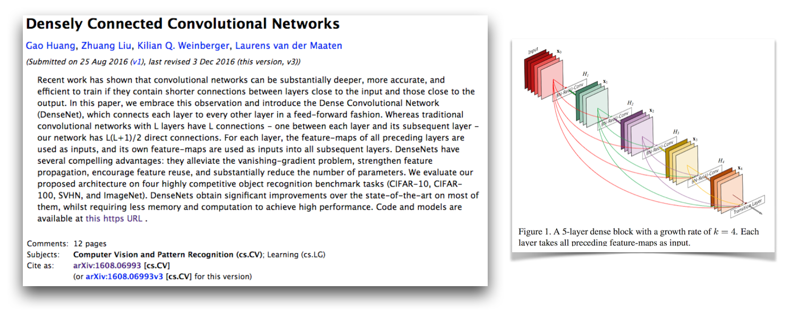
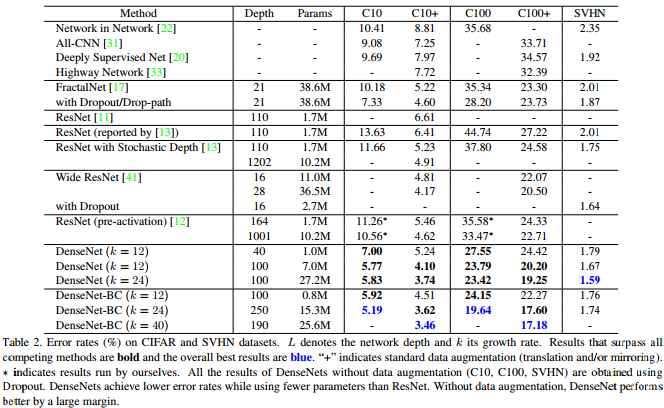
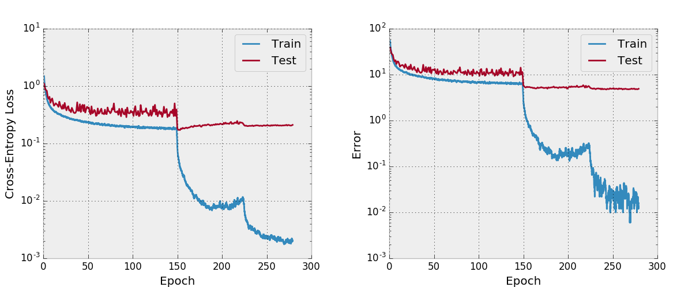
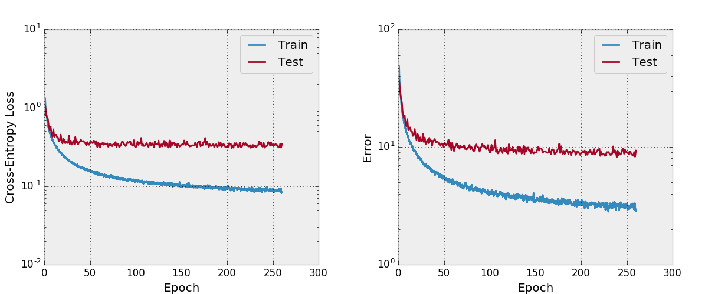

# A PyTorch Implementation of DenseNet

This is a [PyTorch](http://pytorch.org/) implementation of the
DenseNet-BC architecture as described in the
paper [Densely Connected Convolutional Networks](https://arxiv.org/abs/1608.06993)
by G. Huang, Z. Liu, K. Weinberger, and L. van der Maaten.
This implementation gets a CIFAR-10+ error rate of
4.77 with a 100-layer DenseNet-BC with a growth rate of 12.
Their official implementation and links to many other
third-party implementations are available in the
[liuzhuang13/DenseNet](https://github.com/liuzhuang13/DenseNet)
repo on GitHub.



# Why DenseNet?

As this table from the DenseNet paper shows, it provides
competitive state of the art results on CIFAR-10,
CIFAR-100, and SVHN.



# Why yet another DenseNet implementation?

PyTorch is a great new framework and it's nice to have these
kinds of re-implementations around so that they can be integrated
with other PyTorch projects.

# How do you know this implementation is correct?

Interestingly while implementing this, I had a lot of
trouble getting it to converge and looked at every part
of the code closer than I usually would.
I compared all of the model's hidden states and gradients
with the official implementation to make sure my code was correct
and even trained a VGG-style network on CIFAR-10 with the
training code here.
It turns out that I uncovered a new critical PyTorch
bug (now fixed) that was causing this.

I have left around my original message about how this
isn't working and the things that I have checked
[in this document](attic/debugging-discussion.md).
I think this should be interesting for other people to
see my development and debugging strategies when
having issues implementing a model that's known
to converge.
I also started
[this PyTorch forum thread](https://discuss.pytorch.org/t/help-debugging-densenet-model-on-cifar-10/412),
which has a few other discussion points.
You may also be interested in
[my script that
compares PyTorch gradients to Torch gradients](https://github.com/bamos/densenet.pytorch/blob/master/attic/compare-pytorch-and-torch-grads.py)
and
[my script that numerically checks PyTorch gradients](https://github.com/bamos/densenet.pytorch/blob/master/attic/numcheck-grads.py).

My convergence issues were due to a critical PyTorch bug
related to using `torch.cat` with convolutions with cuDNN
enabled (which it is by default when CUDA is used).
This bug caused incorrect gradients and the fix to
this bug is to disable cuDNN (which doesn't have
to be done anymore because it's fixed).
The oversight in my debugging strategies that caused me to
not find this error is that I did not think to disable cuDNN.
Until now, I have assumed that the cuDNN option in frameworks
are bug-free, but have learned that this is not always the case.
I may have also found something if I would have numerically
debugged `torch.cat` layers with convolutions instead of
fully connected layers.

Adam fixed the PyTorch bug that caused this in
[this PR](https://github.com/pytorch/pytorch/pull/708)
and has been merged into Torch's master branch.
**If you are interested in using the DenseNet code in
this repository, make sure your PyTorch version
contains [this PR](https://github.com/pytorch/pytorch/pull/708)
and was downloaded after 2017-02-10.**

# What does the PyTorch compute graph of the model look like?

You can see the compute graph [here](images/model.png),
which I created with [make_graph.py](https://github.com/bamos/densenet.pytorch/blob/master/make_graph.py),
which I copied from
[Adam Paszke's gist](https://gist.github.com/apaszke/01aae7a0494c55af6242f06fad1f8b70).
Adam says PyTorch will soon have a better way to create
compute graphs.

# How does this implementation perform?

By default, this repo trains a 100-layer DenseNet-BC with
an growth rate of 12 on the CIFAR-10 dataset with
data augmentations.
Due to GPU memory sizes, this is the largest model I am able to run.
The paper reports a final test error of 4.51 with this
architecture and we obtain a final test error of 4.77.



# Why don't people use ADAM instead of SGD for training ResNet-style models?

I also tried training a net with ADAM and found that it didn't
converge as well with the default hyper-parameters compared
to SGD with a reasonable learning rate schedule.



# What about the non-BC version?

I haven't tested this as thoroughly, you should make sure
it's working as expected if you plan to use and modify it.
Let me know if you find anything wrong with it.

# A paradigm for ML code

I like to include a few features in my projects
that I don't see in some other re-implementations
that are present in this repo.
The training code in `train.py` uses `argparse` so the batch size
and some other hyper-params can easily be changed
and as the model is training, progress is written
out to csv files in a work directory also defined
by the arguments.
Then a separate script `plot.py` plots the
progress written out by the training script.
The training script calls `plot.py` after every epoch,
but it can importantly be run on its own so figures
can be tweaked without re-running the entire experiment.

# Help wanted: Improving memory utilization and multi-GPU support

I think there are ways to improve the memory utilization
in this code as in the
[the official space-efficient Torch implementation](https://github.com/gaohuang/DenseNet_lite).
I also would be interested in multi-GPU support.

# Running the code and viewing convergence

First install PyTorch (ideally in an anaconda3 distribution).
[./train.py](./train.py) will create a model, start training it,
and save progress to `args.save`, which is
`work/cifar10.base` by default.
The training script will call [plot.py](./plot.py) after
every epoch to create plots from the saved progress.

# Citations

The following is a [BibTeX](http://www.bibtex.org/)
entry for the DenseNet paper that you should cite
if you use this model.

```
@article{Huang2016Densely,
  author = {Huang, Gao and Liu, Zhuang and Weinberger, Kilian Q.},
  title = {Densely Connected Convolutional Networks},
  journal = {arXiv preprint arXiv:1608.06993},
  year = {2016}
}
```

If you use this implementation, please also consider citing this implementation and
code repository with the following BibTeX or plaintext entry.
The BibTeX entry requires the `url` LaTeX package.

```
@misc{amos2017densenet,
  title = {{A PyTorch Implementation of DenseNet}},
  author = {Amos, Brandon and Kolter, J. Zico},
  howpublished = {\url{https://github.com/bamos/densenet.pytorch}},
  note = {Accessed: [Insert date here]}
}

Brandon Amos, J. Zico Kolter
A PyTorch Implementation of DenseNet
https://github.com/bamos/densenet.pytorch.
Accessed: [Insert date here]
```

# Licensing

This repository is
[Apache-licensed](https://github.com/bamos/densenet.pytorch/blob/master/LICENSE).
